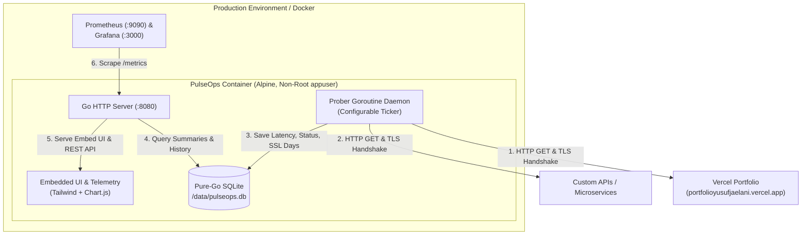

# PulseOps 🩺
> **Cloud-Native Uptime Monitor & Service Health Telemetry Daemon**  
> Lightweight, resilient, single-binary SRE prober built with Go, pure-Go SQLite, embedded Chart.js UI, and native Prometheus metrics.

[](https://github.com/YusufJ12/herco-pulseops/actions)
[](Dockerfile)
[](LICENSE)

---

## 1. Overview & Business Value

**PulseOps** was engineered to solve the observability gap for modern cloud deployments (such as Vercel, cloud APIs, and microservices). It runs periodic HTTP/S health probes, measures network latency, tracks SSL/TLS certificate expiration days, analyzes edge CDN cache headers (`x-vercel-cache`), and calculates rolling SLA uptime percentages.

### Key Highlights
- **Zero-Dependency Single Binary:** Frontend is embedded directly into the Go binary (`//go:embed`). No Node.js runtime, no static file web server needed in production.
- **Pure-Go SQLite:** Uses `modernc.org/sqlite` (no CGO or GCC required). Compiles seamlessly on any architecture (ARM64, AMD64).
- **Embedded Real-Time Telemetry:** Dashboard displays interactive latency charts powered by Chart.js without requiring external dashboards.
- **Enterprise Observability:** Emits Prometheus gauge metrics (`/metrics`) and Kubernetes liveness/readiness probes (`/healthz`, `/readyz`).
- **Hardened Multi-Stage Docker:** Alpine base image running under an unprivileged non-root user (`UID 10001`), resulting in a minimal attack surface and an image size of only ~8.5MB.

---

## 2. Architecture & Request Flow



---

## 3. Codebase Structure & File Map

Untuk memudahkan engineer lain memahami atau melanjutkan pengembangan codebase ini:

```
.
├── .github/
│   └── workflows/
│       └── ci.yml                 # Automated CI: gofmt, unit & integration tests, Docker build smoke test
├── cmd/
│   └── server/
│       └── main.go                # Application entrypoint, graceful shutdown, signal handling (SIGINT/SIGTERM)
├── deploy/
│   ├── grafana/provisioning/      # Auto-provisioned Grafana datasource & pre-configured SRE dashboard
│   └── prometheus/prometheus.yml  # Prometheus scraper configuration targeting pulseops:8080/metrics
├── internal/
│   ├── config/
│   │   └── config.go              # Environment variable loader (PORT, DB_PATH, PROBE_INTERVAL_SECONDS)
│   ├── handler/
│   │   ├── handler.go             # REST API routes, Prometheus /metrics generator, /healthz, /readyz
│   │   └── handler_test.go        # Unit tests for HTTP endpoints and Prometheus output
│   ├── model/
│   │   └── target.go              # Core domain entities: Target, ProbeLog, TargetSummary
│   ├── prober/
│   │   ├── prober.go              # Network probing engine (HTTP latency, TLS/SSL expiry parsing, CDN headers)
│   │   └── prober_test.go         # Unit tests for prober logic with mock HTTP/TLS servers
│   └── store/
│       ├── store.go               # SQLite repository layer (DDL schema, cascade foreign keys, SLA aggregation)
│       └── store_test.go          # Unit tests for database transactions and calculations
├── web/
│   ├── app.js                     # Frontend telemetry logic, polling loop, Chart.js visualization
│   ├── index.html                 # Embedded single-page dashboard styled with Tailwind CSS & FontAwesome
│   └── web.go                     # Go embed declaration exporting web assets as fs.FS
├── Dockerfile                     # Hardened multi-stage build (golang:1.23-alpine -> alpine:3.20)
├── docker-compose.yml             # Orchestration stack: PulseOps + Prometheus + Grafana
├── Makefile                       # Developer task runner (make test, make docker-compose-up)
├── CONTRIBUTING.md                # Guide for contributors, coding conventions & PR checklist
└── README.md                      # Comprehensive system documentation
```

---

## 4. Quick Start

### Opsi A: Menggunakan Docker Compose (Direkomendasikan)
Menjalankan seluruh ekosistem (PulseOps, Prometheus, dan Grafana) dalam satu perintah:

```bash
docker compose up -d --build
```

Akses layanan:
- **PulseOps Dashboard & Live Chart:** [http://localhost:8080](http://localhost:8080)
- **Raw Prometheus Metrics:** [http://localhost:8080/metrics](http://localhost:8080/metrics)
- **Kubernetes Health Check:** [http://localhost:8080/healthz](http://localhost:8080/healthz)
- **Prometheus Scraper:** [http://localhost:9090](http://localhost:9090)
- **Grafana SRE Dashboard:** [http://localhost:3000](http://localhost:3000) *(Anonymous auto-login diaktifkan)*

Untuk mematikan:
```bash
docker compose down
```

---

### Opsi B: Menjalankan Secara Lokal (Tanpa Docker)
Jika memiliki Go 1.23+ terinstall:

```bash
# 1. Unduh modul dependensi
go mod download

# 2. Jalankan test suite
go test -v ./...

# 3. Jalankan daemon server
DB_PATH=./pulseops.db PORT=8080 go run ./cmd/server
```

---

## 5. Developer Task Runner (`Makefile`)

Tersedia target `make` untuk standarisasi proses development tim:

| Perintah | Fungsi |
|---|---|
| `make test` | Menjalankan seluruh unit & integration test melalui container terisolasi |
| `make docker-build` | Membangun image Docker production `pulseops:latest` |
| `make docker-compose-up` | Membangun dan menjalankan seluruh stack di background |
| `make docker-compose-down` | Menghentikan dan membersihkan container |
| `make clean` | Menghapus container beserta persistent volumes |

---

## 6. Environment Variables Reference

Aplikasi dapat dikonfigurasi melalui Environment Variables tanpa mengubah kode sumber:

| Variable | Default | Wajib? | Deskripsi |
|---|---|:---:|---|
| `PORT` | `8080` | Tidak | Port HTTP listen server |
| `DB_PATH` | `/data/pulseops.db` | Tidak | Lokasi file SQLite persistent |
| `PROBE_INTERVAL_SECONDS` | `30` | Tidak | Interval pemeriksaan probe otomatis oleh daemon |
| `DEFAULT_TARGET_URL` | `https://portfolioyusufjaelani.vercel.app` | Tidak | Target awal yang otomatis di-seed saat database kosong |
| `DEFAULT_TARGET_NAME` | `Yusuf Portfolio` | Tidak | Label deskriptif untuk target awal |

---

## 7. REST API & Telemetry Endpoints

### Health & Observability
- **`GET /healthz`**  
  Liveness probe untuk Kubernetes atau container orchestrator.  
  *Response:* `{"status":"ok"}` (200 OK)

- **`GET /readyz`**  
  Readiness probe yang memverifikasi kesehatan koneksi database SQLite.  
  *Response:* `{"status":"ready"}` (200 OK)

- **`GET /metrics`**  
  Prometheus text format metric exporter untuk monitoring eksternal:
  - `pulseops_targets_total`
  - `pulseops_target_up{id="...",name="...",url="..."}`
  - `pulseops_target_latency_ms{id="...",name="...",url="..."}`
  - `pulseops_target_ssl_expiry_days{id="...",name="...",url="..."}`
  - `pulseops_target_uptime_percent{id="...",name="...",url="..."}`

### Target Management API
- **`GET /api/targets`**  
  Mengambil daftar semua target beserta ringkasan status probe terakhir dan kalkulasi SLA.
- **`POST /api/targets`**  
  Mendaftarkan target baru. Langsung memicu probe pertama secara sinkron.
  ```json
  {
    "name": "Production Payment API",
    "url": "https://api.example.com/health"
  }
  ```
- **`DELETE /api/targets/{id}`**  
  Menghapus target dari pemantauan beserta riwayat log terkait (*cascade delete*).
- **`POST /api/targets/{id}/probe`**  
  Memicu probe on-demand secara instan tanpa menunggu interval daemon berikutnya.
- **`GET /api/targets/{id}/history?limit=30`**  
  Mengambil data historis time-series untuk visualisasi grafik latensi.

---

## 8. Panduan untuk Engineer yang Melanjutkan (Handover Guide)

### Mengapa Pure-Go SQLite (`modernc.org/sqlite`)?
Alih-alih driver CGO seperti `mattn/go-sqlite3` yang memerlukan GCC, pustaka C, dan komplikasi cross-compile, driver ini ditulis 100% dalam Go murni. Manfaatnya:
- Binary dapat dikompilasi ke target Linux `CGO_ENABLED=0` secara statis tanpa dependensi `libc` eksternal.
- Build Docker berukuran sangat kecil (~8.5MB) dan bebas dari celah keamanan pustaka C host.

### Cara Menambahkan Metrik Baru (Contoh: Time to First Byte / TTFB)
1. **Model:** Buka `internal/model/target.go`, tambahkan field `TTFBMs int64` pada `ProbeLog`.
2. **Database:** Tambahkan kolom pada tabel `probe_logs` di `internal/store/store.go`.
3. **Probing Engine:** Gunakan `httptrace.ClientTrace` pada `internal/prober/prober.go` untuk mencatat durasi `GotFirstResponseByte`.
4. **Prometheus Exporter:** Tambahkan gauge `pulseops_target_ttfb_ms` pada fungsi `handleMetrics` di `internal/handler/handler.go`.
5. **Frontend:** Tambahkan label telemetri baru pada `web/app.js`.

### Cara Menginspeksi Database SQLite di Container
```bash
# Query langsung ke database SQLite di dalam volume
docker compose exec pulseops /bin/sh -c "ls -lh /data"
```

---

## 9. Security & Production Hardening

- **Non-Root Execution:** Kontainer berjalan di bawah user `appuser:appgroup` (`UID 10001`). Proses tidak memiliki hak akses root.
- **Graceful Shutdown:** `cmd/server/main.go` menangani sinyal OS `SIGINT` dan `SIGTERM` dengan `context.WithTimeout(5s)`, memastikan koneksi aktif diselesaikan dan database di-flush sebelum proses keluar.
- **Strict Client Timeout:** Prober menggunakan timeout ketat (10 detik) dan batas redirect maksimal 5 hops untuk mencegah DoS / kebocoran goroutine pada target lambat.
- **SonarLint Zero Code Smells:** Seluruh kode Go, HTML, dan JavaScript telah diverifikasi bersih dari issue SonarLint (cognitive complexity < 15, zero label warnings, clean scoping).

---

## 10. Panduan Deployment Cloud (Render.com / PaaS)

Aplikasi ini siap di-deploy langsung ke platform cloud gratis seperti **Render.com** tanpa memerlukan VPS:

1. Push repository ini ke GitHub.
2. Buka [dashboard.render.com](https://dashboard.render.com/) -> klik **New +** -> **Web Service**.
3. Hubungkan ke repository ini.
4. Render akan otomatis mendeteksi `Dockerfile` multi-stage:
   - Environment: **Docker**
   - Plan: **Free**
5. Klik **Create Web Service**. Dalam waktu ~2 menit, PulseOps akan online dengan HTTPS gratis dan auto-renewal SSL.

---

## 11. Vibe Coding & AI Collaboration Statement

Proyek ini dirancang dan dikembangkan dengan memanfaatkan integrasi **GitHub Copilot (AI / Vibe Coding)**:
- **Arsitektur Cepat & Tepat:** AI digunakan untuk mempercepat scaffolding pola SRE cloud-native, penyusunan Docker multi-stage, dan pembuatan mock test suite.
- **Verifikasi Kualitas Ketat:** Setiap output diverifikasi terhadap standar keamanan SRE (user non-root, CGO disabled, timeout boundaries, dan kepatuhan SonarQube).
- **Human-in-the-Loop:** Keputusan desain (pemilihan pure-Go SQLite, embedded Chart.js, penghapusan ketergantungan link localhost) diambil secara terarah untuk menghasilkan produk siap produksi yang mudah dirawat oleh engineer mana pun.
