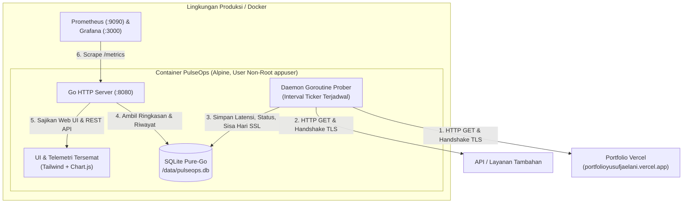

# PulseOps 🩺
> **Daemon Pemantau Uptime & Telemetri Kesehatan Layanan Berbasis Cloud-Native**  
> Prober SRE ringan, tangguh, berformat single-binary yang dibangun dengan Go, SQLite pure-Go, antarmuka Chart.js tersemat, dan metrik Prometheus bawaan.

[](https://github.com/YusufJ12/herco-pulseops/actions)
[](Dockerfile)
[](LICENSE)

---

## 1. Ikhtisar & Nilai Bisnis

**PulseOps** dirancang untuk menjembatani celah observabilitas pada arsitektur cloud modern (seperti Vercel, API cloud, dan microservices). Aplikasi ini menjalankan probe kesehatan HTTP/S berkala, mengukur latensi jaringan, melacak sisa masa aktif sertifikat SSL/TLS, menganalisis header cache CDN edge (`x-vercel-cache`), dan mengkalkulasi persentase uptime SLA berjalan.

### Fitur Unggulan
- **Single Binary Tanpa Dependensi Luar:** Tampilan web tersemat langsung di dalam binary Go (`//go:embed`). Tidak membutuhkan runtime Node.js atau web server berkas statis terpisah di lingkungan produksi.
- **SQLite Pure-Go:** Menggunakan driver `modernc.org/sqlite` (tanpa dependensi CGO atau compiler GCC). Dapat dikompilasi mulus di arsitektur apa pun (ARM64, AMD64).
- **Telemetri Real-Time Tersemat:** Dashboard visual langsung menyajikan grafik latensi interaktif bertenaga Chart.js tanpa ketergantungan pada dashboard eksternal.
- **Observabilitas Standar Enterprise:** Menyediakan eksporter metrik gauge format Prometheus (`/metrics`) serta probe liveness/readiness Kubernetes (`/healthz`, `/readyz`).
- **Keamanan Docker Multi-Stage:** Base image Alpine minimalis yang berjalan di bawah user non-root tanpa hak istimewa (`UID 10001`), dengan ukuran image akhir hanya ~8.5MB.

---

## 2. Arsitektur & Alur Permintaan



---

## 3. Struktur Kode & Peta Berkas

Untuk mempermudah engineer memahami tata letak dan peran tiap komponen:

```
.
├── .github/
│   └── workflows/
│       └── ci.yml                 # CI Otomatis: gofmt, test unit & integrasi, build smoke test Docker
├── cmd/
│   └── server/
│       └── main.go                # Entrypoint aplikasi, graceful shutdown, penanganan sinyal (SIGINT/SIGTERM)
├── deploy/
│   ├── grafana/provisioning/      # Datasource Grafana & dashboard SRE otomatis terpasang
│   └── prometheus/prometheus.yml  # Konfigurasi scraper Prometheus ke pulseops:8080/metrics
├── internal/
│   ├── config/
│   │   └── config.go              # Pengurai environment variable (PORT, DB_PATH, PROBE_INTERVAL_SECONDS)
│   ├── handler/
│   │   ├── handler.go             # Router REST API, eksporter /metrics Prometheus, /healthz, /readyz
│   │   └── handler_test.go        # Pengujian unit endpoint HTTP dan keluaran format Prometheus
│   ├── model/
│   │   └── target.go              # Entitas domain utama: Target, ProbeLog, TargetSummary
│   ├── prober/
│   │   ├── prober.go              # Engine probing jaringan (latensi HTTP, masa aktif SSL, header CDN)
│   │   └── prober_test.go         # Pengujian unit engine prober dengan mock server HTTP/TLS
│   └── store/
│       ├── store.go               # Lapisan repositori SQLite (skema DDL, relasi foreign key, kalkulasi SLA)
│       └── store_test.go          # Pengujian unit transaksi database dan agregasi data
├── web/
│   ├── app.js                     # Logika frontend, polling data telemetri, grafik Chart.js
│   ├── index.html                 # Halaman dashboard tunggal berbalut Tailwind CSS & FontAwesome
│   └── web.go                     # Deklarasi Go embed untuk mengekspor berkas web sebagai fs.FS
├── Dockerfile                     # Build multi-stage aman (golang:1.23-alpine -> alpine:3.20)
├── docker-compose.yml             # Orkestrator stack: PulseOps + Prometheus + Grafana
├── Makefile                       # Runner perintah developer (make test, make docker-compose-up)
└── README.md                      # Dokumentasi komprehensif tunggal (termasuk panduan kontribusi & testing)
```

---

## 4. Panduan Memulai Cepat

### Opsi A: Menggunakan Docker Compose (Direkomendasikan)
Menjalankan seluruh ekosistem (PulseOps, Prometheus, dan Grafana) dalam satu perintah:

```bash
docker compose up -d --build
```

Akses layanan:
- **Dashboard PulseOps & Grafik Live:** [http://localhost:8080](http://localhost:8080)
- **Metrik Prometheus Mentah:** [http://localhost:8080/metrics](http://localhost:8080/metrics)
- **Pemeriksaan Kesehatan (Health Check):** [http://localhost:8080/healthz](http://localhost:8080/healthz)
- **Scraper Prometheus:** [http://localhost:9090](http://localhost:9090)
- **Dashboard SRE Grafana:** [http://localhost:3000](http://localhost:3000) *(Login otomatis tanpa kata sandi)*

Untuk mematikan:
```bash
docker compose down
```

---

### Opsi B: Menjalankan Secara Lokal (Tanpa Docker)
Jika memiliki Go 1.23+ terinstall:

```bash
# 1. Unduh modul dependensi
go mod download

# 2. Jalankan test suite
go test -v ./...

# 3. Jalankan daemon server
DB_PATH=./pulseops.db PORT=8080 go run ./cmd/server
```

---

## 5. Pengujian Otomatis & Pipeline CI/CD (Automated Testing)

PulseOps mengimplementasikan strategi pengujian otomatis menyeluruh untuk menjamin keandalan sistem SRE:

### A. Cakupan Unit & Integration Test
- **`internal/store/store_test.go`**:
  - Inisialisasi skema DDL SQLite pure-Go dan integritas foreign key.
  - Penyimpanan target dan pencatatan log telemetri probe.
  - Kalkulasi persentase SLA uptime berjalan.
  - Uji *cascade delete*: memastikan penghapusan target membersihkan riwayat log terkait tanpa menyisakan *orphan record*.
- **`internal/prober/prober_test.go`**:
  - Pengujian probe HTTP terhadap mock server (skenario sukses `HTTP 200` vs skenario kegagalan `HTTP 500`).
  - Validasi ketat format URL (skema `http`/`https`, host valid vs skema ilegal).
  - Pengujian batas waktu jaringan (*timeout boundary*).
- **`internal/handler/handler_test.go`**:
  - Validasi endpoint Kubernetes `/healthz` dan `/readyz`.
  - Endpoint REST API pembuatan target (`POST /api/targets`) dan daftar ringkasan (`GET /api/targets`).
  - Validasi struktur output metrik teks eksporter Prometheus (`/metrics`).

### B. Otomasi di CI/CD (GitHub Actions)
Setiap kali ada `push` atau `Pull Request` ke branch `main`, workflow `.github/workflows/ci.yml` secara otomatis mengeksekusi:
1. **Pemeriksaan Format (`gofmt`)**: Memastikan konsistensi gaya kode standar Go.
2. **Eksekusi Test & Coverage**: Menjalankan seluruh test suite dan menghasilkan laporan coverage (`go test -v -coverprofile=coverage.txt`).
3. **Docker Build Smoke Test**: Menguji proses kompilasi container multi-stage dan memverifikasi kesehatan liveness probe `/healthz`.

### C. Menjalankan Test Sendiri Secara Mandiri
Pilih salah satu cara berikut:
```bash
# Cara 1: Menggunakan Makefile (Otomatis via container terisolasi)
make test

# Cara 2: Menggunakan Docker langsung (tanpa perlu install Go di komputer)
docker run --rm -v "${PWD}:/app" -w /app golang:1.23-alpine go test -v ./...

# Cara 3: Menggunakan CLI Go lokal (jika Go terpasang)
go test -v ./...
```

---

## 6. Task Runner Pengembang (`Makefile`)

Tersedia target `make` untuk standarisasi proses development tim:

| Perintah | Fungsi |
|---|---|
| `make test` | Menjalankan seluruh unit & integration test melalui container terisolasi |
| `make docker-build` | Membangun image Docker production `pulseops:latest` |
| `make docker-compose-up` | Membangun dan menjalankan seluruh stack di background |
| `make docker-compose-down` | Menghentikan dan membersihkan container |
| `make clean` | Menghapus container beserta persistent volumes |

---

## 6. Referensi Environment Variables

Aplikasi dapat dikonfigurasi melalui Environment Variables tanpa mengubah kode sumber:

| Variable | Default | Wajib? | Deskripsi |
|---|---|:---:|---|
| `PORT` | `8080` | Tidak | Port HTTP listen server |
| `DB_PATH` | `/data/pulseops.db` | Tidak | Lokasi file SQLite persistent |
| `PROBE_INTERVAL_SECONDS` | `30` | Tidak | Interval pemeriksaan probe otomatis oleh daemon |
| `DEFAULT_TARGET_URL` | `https://portfolioyusufjaelani.vercel.app` | Tidak | Target awal yang otomatis di-seed saat database kosong |
| `DEFAULT_TARGET_NAME` | `Yusuf Portfolio` | Tidak | Label deskriptif untuk target awal |

---

## 7. Referensi REST API & Endpoint Telemetri

### Kesehatan & Observabilitas
- **`GET /healthz`**  
  Liveness probe untuk Kubernetes atau orchestrator container.  
  *Response:* `{"status":"ok"}` (200 OK)

- **`GET /readyz`**  
  Readiness probe yang memverifikasi kesehatan koneksi database SQLite.  
  *Response:* `{"status":"ready"}` (200 OK)

- **`GET /metrics`**  
  Eksporter metrik teks format Prometheus untuk sistem pemantau eksternal:
  ```prometheus
  # HELP pulseops_targets_total Total number of monitored targets
  # TYPE pulseops_targets_total gauge
  pulseops_targets_total 1

  # HELP pulseops_target_up Status of target: 1 = UP, 0 = DOWN
  # TYPE pulseops_target_up gauge
  pulseops_target_up{id="1",name="Yusuf Portfolio",url="https://portfolioyusufjaelani.vercel.app"} 1

  # HELP pulseops_target_latency_ms Latest latency in milliseconds
  # TYPE pulseops_target_latency_ms gauge
  pulseops_target_latency_ms{id="1",name="Yusuf Portfolio",url="https://portfolioyusufjaelani.vercel.app"} 142

  # HELP pulseops_target_ssl_expiry_days Days until SSL certificate expires
  # TYPE pulseops_target_ssl_expiry_days gauge
  pulseops_target_ssl_expiry_days{id="1",name="Yusuf Portfolio",url="https://portfolioyusufjaelani.vercel.app"} 78

  # HELP pulseops_target_uptime_percent Rolling uptime percentage
  # TYPE pulseops_target_uptime_percent gauge
  pulseops_target_uptime_percent{id="1",name="Yusuf Portfolio",url="https://portfolioyusufjaelani.vercel.app"} 100.00
  ```

### API Pengelolaan Target
- **`GET /api/targets`**  
  Mengambil daftar semua target beserta ringkasan status probe terakhir dan kalkulasi SLA.
- **`POST /api/targets`**  
  Mendaftarkan target baru. Langsung memicu probe pertama secara sinkron.
  ```json
  {
    "name": "Production Payment API",
    "url": "https://api.example.com/health"
  }
  ```
- **`DELETE /api/targets/{id}`**  
  Menghapus target dari pemantauan beserta riwayat log terkait (*cascade delete*).
- **`POST /api/targets/{id}/probe`**  
  Memicu probe on-demand secara instan tanpa menunggu interval daemon berikutnya.
- **`GET /api/targets/{id}/history?limit=30`**  
  Mengambil data historis time-series untuk visualisasi grafik latensi.

---

## 8. Panduan untuk Engineer Penerus (Handover Guide)

### Mengapa Pure-Go SQLite (`modernc.org/sqlite`)?
Alih-alih driver CGO seperti `mattn/go-sqlite3` yang memerlukan GCC, pustaka C, dan komplikasi cross-compile, driver ini ditulis 100% dalam Go murni. Manfaatnya:
- Binary dapat dikompilasi ke target Linux `CGO_ENABLED=0` secara statis tanpa dependensi `libc` eksternal.
- Build Docker berukuran sangat kecil (~8.5MB) dan bebas dari celah keamanan pustaka C host.

### Cara Menambahkan Metrik Baru (Contoh: Time to First Byte / TTFB)
1. **Model:** Buka `internal/model/target.go`, tambahkan field `TTFBMs int64` pada struct `ProbeLog`.
2. **Database:** Tambahkan kolom pada tabel `probe_logs` di `internal/store/store.go` (`InitDB`).
3. **Probing Engine:** Gunakan `httptrace.ClientTrace` pada `internal/prober/prober.go` untuk mencatat durasi `GotFirstResponseByte`.
4. **Prometheus Exporter:** Tambahkan gauge `pulseops_target_ttfb_ms` pada fungsi `handleMetrics` di `internal/handler/handler.go`.
5. **Frontend:** Tambahkan label telemetri baru pada `web/app.js` dan `web/index.html`.

### Cara Menambahkan Notifikasi Alert Webhook (Contoh: Discord / Telegram / Slack)
1. Daftarkan variabel `ALERT_WEBHOOK_URL` di `internal/config/config.go`.
2. Di `internal/prober/prober.go`, deteksi perubahan status target (misalnya status sebelumnya `UP`, status saat ini menjadi `DOWN`).
3. Kirim payload HTTP POST ke webhook URL secara asinkron menggunakan goroutine non-blocking.

### Cara Menginspeksi Database SQLite di Container
```bash
# Periksa keberadaan file database SQLite di dalam volume container
docker compose exec pulseops /bin/sh -c "ls -lh /data"
```

---

## 9. Panduan Kontribusi & Standar Pengembang (Contributing Guide)

Seluruh panduan kontribusi telah disatukan di sini agar setiap engineer dapat langsung berkolaborasi dengan standar yang sama:

### A. Prinsip Inti Pengembangan
- **YAGNI & Minim Dependensi:** Utamakan pustaka standar Go (`net/http`, `crypto/tls`, `log/slog`) untuk binary yang ramping dan performa tinggi tanpa dependensi yang tidak diperlukan.
- **Portabilitas Pure-Go:** Menjaga agar driver database tetap menggunakan `modernc.org/sqlite` sehingga kompilasi bebas CGO (`CGO_ENABLED=0`) dan dapat berjalan di scratch/alpine container tanpa GCC.
- **Kualitas Bersih (Zero-Warning):** Kode Go, HTML, dan JavaScript harus bersih dari issue SonarLint/SonarQube (kompleksitas kognitif < 15, aksesibilitas form label valid, scope variabel terisolasi).

### B. Menjalankan Pengembangan Langsung (Native Go)
Jika tidak ingin menggunakan Docker saat development:
```bash
# 1. Unduh dependensi modul Go
go mod download

# 2. Jalankan seluruh test unit & integrasi
go test -v ./...

# 3. Jalankan server secara lokal
DB_PATH=./pulseops.db PORT=8080 go run ./cmd/server
```

### C. Format Pesan Commit (Conventional Commits)
Setiap commit wajib mengikuti format terstruktur:
- `feat: ...` untuk penambahan fitur baru
- `fix: ...` untuk perbaikan bug
- `refactor: ...` untuk restrukturisasi kode tanpa mengubah perilaku fitur
- `docs: ...` untuk perubahan dokumentasi
- `test: ...` untuk penambahan atau pembaruan pengujian otomatis

### D. Checklist Sebelum Mengajukan Pull Request
Sebelum push ke branch `main` atau membuka PR:
- [ ] Seluruh pengujian otomatis lulus 100%: `make test` atau `go test -v ./...`
- [ ] Format kode rapi sesuai standar Go: `go fmt ./...`
- [ ] Image Docker berhasil dibangun: `make docker-build`
- [ ] Tidak ada hardcoded credential, secret, atau tautan localhost di tampilan produksi.
- [ ] SonarLint menunjukkan 0 warning / 0 code smell di IDE.

---

## 10. Keamanan & Pengerasan Produksi (Security Hardening)

- **Non-Root Execution:** Kontainer berjalan di bawah user `appuser:appgroup` (`UID 10001`). Proses tidak memiliki hak akses root di dalam container.
- **Graceful Shutdown:** `cmd/server/main.go` menangani sinyal OS `SIGINT` dan `SIGTERM` dengan `context.WithTimeout(5s)`, memastikan koneksi aktif diselesaikan dan database di-flush sebelum proses keluar.
- **Strict Client Timeout:** Prober menggunakan timeout ketat (10 detik) dan batas redirect maksimal 5 hops untuk mencegah DoS / kebocoran goroutine pada target lambat.
- **SonarLint Zero Code Smells:** Seluruh kode Go, HTML, dan JavaScript telah diverifikasi bersih dari issue SonarLint.

---

## 11. Panduan Deployment Cloud (Render.com / PaaS)

Aplikasi ini siap di-deploy langsung ke platform cloud gratis seperti **Render.com** tanpa memerlukan VPS:

1. Push repository ini ke GitHub.
2. Buka [dashboard.render.com](https://dashboard.render.com/) -> klik **New +** -> **Web Service**.
3. Hubungkan ke repository ini.
4. Render akan otomatis mendeteksi `Dockerfile` multi-stage:
   - Environment: **Docker**
   - Plan: **Free**
5. Klik **Create Web Service**. Dalam waktu ~2 menit, PulseOps akan online dengan HTTPS gratis dan auto-renewal SSL.

---

## 12. Pernyataan Kolaborasi AI & Vibe Coding

Proyek ini dirancang dan dikembangkan dengan memanfaatkan integrasi **GitHub Copilot (AI / Vibe Coding)**:
- **Arsitektur Cepat & Tepat:** AI digunakan untuk mempercepat scaffolding pola SRE cloud-native, penyusunan Docker multi-stage, dan pembuatan mock test suite.
- **Verifikasi Kualitas Ketat:** Setiap output diverifikasi terhadap standar keamanan SRE (user non-root, CGO disabled, timeout boundaries, dan kepatuhan SonarQube).
- **Human-in-the-Loop:** Keputusan desain (pemilihan pure-Go SQLite, embedded Chart.js, penghapusan ketergantungan link localhost) diambil secara terarah untuk menghasilkan produk siap produksi yang mudah dirawat oleh engineer mana pun.
