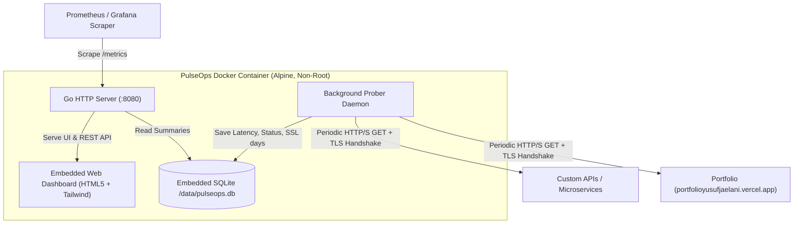

# PulseOps 🩺
> **Cloud-Native Uptime Monitor & Service Health Probe**  
> Lightweight, resilient, single-binary SRE telemetry daemon built with Go, SQLite, and embedded Web UI.

[](https://github.com/yusufjaelani/pulseops/actions)
[](Dockerfile)
[](LICENSE)

---

## 1. Overview & Objective

**PulseOps** was engineered to solve the observability gap for modern cloud deployments (such as Vercel, serverless apps, and microservices). It runs periodic HTTP/S health probes, measures network latency, tracks SSL/TLS certificate expiration days, analyzes edge CDN cache headers (`x-vercel-cache`), and calculates rolling SLA uptime percentages.

### Key Capabilities
- **Periodic Probe Daemon:** Background goroutines probe targets concurrently at configurable intervals.
- **TLS/SSL Inspection:** Auto-detects remaining certificate lifespan in days to prevent surprise outages.
- **Edge Header Telemetry:** Tracks server signatures, Vercel cache hit/miss statuses, and Cloudflare ray IDs.
- **Prometheus Exporter (`/metrics`):** Native Prometheus gauge metrics ready for Grafana / Alertmanager.
- **Production Endpoints (`/healthz`, `/readyz`):** Kubernetes-ready liveness and readiness probes.
- **Single-Binary Zero-Dependency Deploy:** Web frontend is embedded directly into the Go binary (`//go:embed`). Docker image is ~8.5MB.

---

## 2. Architecture



---

## 3. Quick Start (Docker)

### Prasyarat
- [Docker](https://docs.docker.com/get-docker/) & Docker Compose

### Jalankan dengan 1 Perintah
```bash
docker compose up -d --build
```

Buka di browser:
- **Web Dashboard:** [http://localhost:8080](http://localhost:8080)
- **Prometheus Metrics:** [http://localhost:8080/metrics](http://localhost:8080/metrics)
- **Liveness Probe:** [http://localhost:8080/healthz](http://localhost:8080/healthz)
- **Readiness Probe:** [http://localhost:8080/readyz](http://localhost:8080/readyz)

Secara default, PulseOps langsung mengawasi: `https://portfolioyusufjaelani.vercel.app`.

### Menghentikan Container
```bash
docker compose down
```

---

## 4. Environment Variables

| Variable | Default | Deskripsi |
|---|---|---|
| `PORT` | `8080` | Port HTTP server |
| `DB_PATH` | `/data/pulseops.db` | Lokasi file SQLite persistent |
| `PROBE_INTERVAL_SECONDS` | `30` | Interval pemeriksaan probe otomatis |
| `DEFAULT_TARGET_URL` | `https://portfolioyusufjaelani.vercel.app` | Seed target awal saat pertama dijalankan |
| `DEFAULT_TARGET_NAME` | `Yusuf Portfolio` | Label nama target awal |

---

## 5. API Reference

### Health & Observability
- `GET /healthz`  
  Response: `{"status":"ok"}`
- `GET /readyz`  
  Memvalidasi konektivitas database. Response: `{"status":"ready"}`
- `GET /metrics`  
  Prometheus text format metric exporter:
  - `pulseops_targets_total`
  - `pulseops_target_up{id="...",name="...",url="..."}`
  - `pulseops_target_latency_ms{id="...",name="...",url="..."}`
  - `pulseops_target_ssl_expiry_days{id="...",name="...",url="..."}`
  - `pulseops_target_uptime_percent{id="...",name="...",url="..."}`

### Target Management
- `GET /api/targets` — Menampilkan semua target dan status probe terakhir.
- `POST /api/targets` — Menambahkan target baru.
  ```json
  {
    "name": "Payment Gateway API",
    "url": "https://api.example.com/health"
  }
  ```
- `DELETE /api/targets/{id}` — Menghapus target monitoring.
- `POST /api/targets/{id}/probe` — Menjalankan instant probe on-demand.
- `GET /api/targets/{id}/history?limit=30` — Mengambil riwayat log probe untuk chart/telemetri.

---

## 6. Automated Testing & CI/CD

Pipeline CI/CD otomatis berjalan di GitHub Actions (`.github/workflows/ci.yml`):

1. **Unit & Integration Tests:**
   - Database schema migrations, cascade deletions, SLA calculations.
   - Prober HTTP status checks, TLS certificate expiry parsing, URL validation.
   - HTTP Handlers, Prometheus metrics format validation.
2. **Docker Multi-Stage Build & Smoke Test:**
   - Memvalidasi proses build container tanpa CGO.
   - Menjalankan container dan melakukan smoke test ke `/healthz` dan `/metrics`.

### Menjalankan Test Secara Lokal
Jika memiliki Docker:
```bash
docker run --rm -v "${PWD}:/app" -w /app golang:1.23-alpine go test -v ./...
```
Jika memiliki Go lokal:
```bash
go test -v ./...
```

---

## 7. Production Hardening & Security

- **Non-Root Execution:** Container berjalan di bawah user `appuser:appgroup` (UID `10001`).
- **Minimal Surface:** Base image menggunakan `alpine:3.20` dengan stripped binary `-ldflags="-s -w"`, total image hanya ~8.5MB.
- **Graceful Shutdown:** Menangkap sinyal `SIGINT` dan `SIGTERM` untuk menghentikan server dan probe goroutine secara bersih tanpa data loss.
- **Connection Isolation:** Client HTTP memiliki `Timeout: 10s` dan batas redirect maksimal 5 hops untuk mencegah DoS / hang goroutine.

---

## 8. Panduan Deployment Online Gratis (Tanpa VPS)

Aplikasi ini dapat di-deploy 1-klik ke **Render.com** secara gratis:

1. Push repositori ini ke akun GitHub kamu.
2. Buka [dashboard.render.com](https://dashboard.render.com/) -> klik **New +** -> **Web Service**.
3. Pilih repository GitHub ini.
4. Render otomatis mendeteksi `Dockerfile`:
   - Runtime: **Docker**
   - Plan: **Free**
5. Klik **Create Web Service**. Dalam 2 menit aplikasi akan live di domain publik dengan HTTPS otomatis (contoh: `https://pulseops-xyz.onrender.com`).

---

## 9. Catatan AI-Assisted Development

Projek ini dibangun menggunakan **GitHub Copilot / AI-Assisted Development** dengan prinsip:
- **YAGNI & Zero Bloat:** Standard library Go `net/http` dan pure-Go SQLite tanpa dependency raksasa yang tidak diperlukan.
- **Single Source of Truth:** Telemetri live langsung diekspos ke Prometheus dan Web UI dari state yang sama.
- **Clear Handover:** Struktur kode modular (`cmd/`, `internal/store`, `internal/prober`, `internal/handler`, `web/`) memudahkan engineer berikutnya melakukan maintainability dan scaling.
